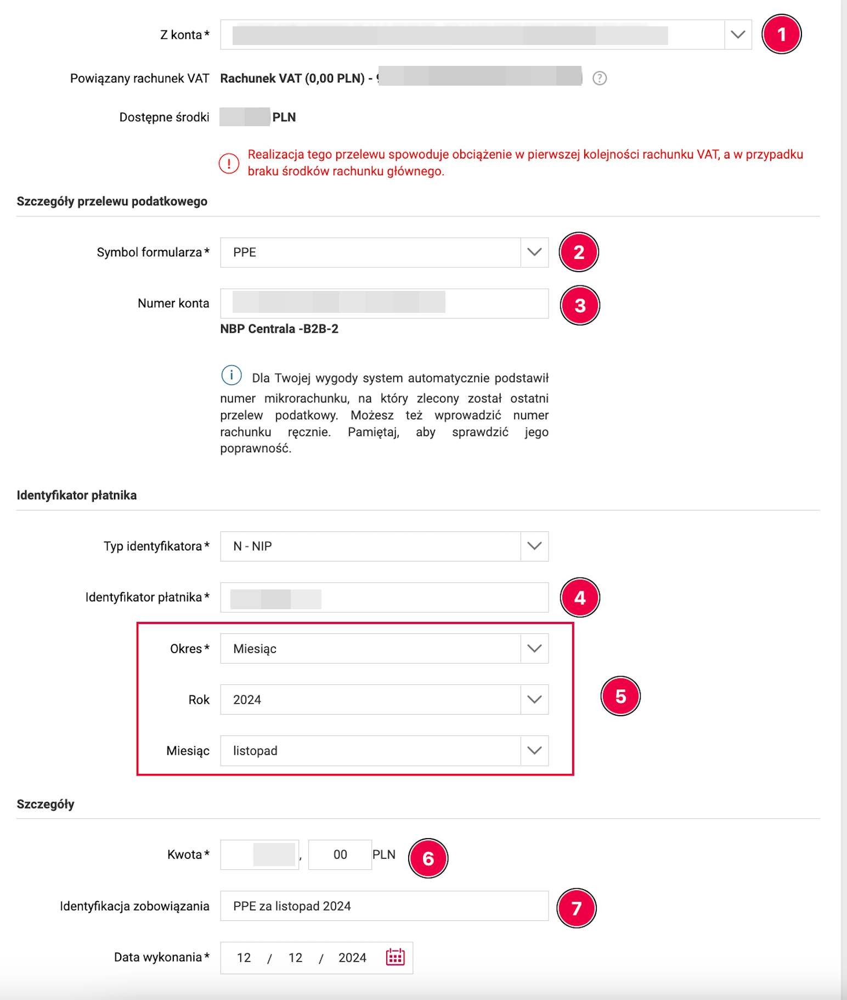

# Рутинные операции ИП (ежемесячно) с использованием infakt.pl

Данный документ описывает типичные операции ИП-шника на ryczałt в программе infakt.pl.
Минимальная настройка infakt описана [здесь][1].

Зарегистрируйтесь в infakt по [нашей ссылке][2] и получите 100zł кэшбэка.

## Выставление фактур

В последний день месяца (если у вас с заказчиком договоренность на помесячную оплату), или по факту выполнения (отгрузки) работ необходимо сгенерировать и выставить фактуру заказчику. Для этого перейдите в раздел [Przychody][3] и нажать кнопку **Nowa faktura**.

![Nowa faktura][4]

То же самое можно получить из списка контрагентов:

**Przychody -> Klienci -> Nowa faktura**

Для выбранного заказчика, либо из списка услуг:

**Przychody -> Produkty**, чекнуть нужную услугу, и выбрать **Nowa faktura**.

В новой фактуре выбираем/корректируем необходимые поля (если не выбрано):

1. заказчика (из списка)
2. дату оказания услуги (последний день месяца либо дату фактической услуги, если они нерегулярны)
3. выбор варианта оплаты фактуры, наиболее вероятно это будет **Przelew** (перевод на банковский счет) и выбрать счет (если их несколько). А если ни один счет не добавлен, то сервис предложит его добавить
4. услугу
5. количество "услуги" (если почасовая, то кол-во отработанных часов, если фиксированная ставка, то оставляем 1, так как сумма нетто уже есть ставка)
6. ставку VAT (более подробно - на [странице, посвященной VAT][5])

![6]

Нажимаете кнопку **Zapisz szkic** для сохранения данных. Фактура записана!

!!! warning "Важно"
    На этом этапе фактура еще не участвует в расчете налоговой базы за выбранный месяц (пока она находится в статусе `SZKIC`). Для того чтобы фактура попала в зачет, необходимо ее напечатать или выслать клиенту.

Для этого нужно в [списке фактур][3] выбрать нужную фактуру, и выбрать **Pobierz PDF**, там же будет и выбор языков.

![7]

После печати статус фактуры сменяется на `WYDRUKOWANO` и она начинает считаться в налог на следующий месяц и в ZUS.

Также фактуру можно сразу отправить на e-mail клиента выбрав пункт **Wyślij e-mailem**

## Оплата налогов

!!! warning "Важно"
    Убедитесь что все фактуры добавлены и в статусе `WYDRUKOWANO` или `WYSŁANO`, а так же все курсовые разницы за отчетный период внесены и учтены.

Узнать свой счет для уплаты налогов можно [тут][8].
Infakt получает номер счета автоматически при настройке.

Налог необходимо оплатить до 20го числа следующего месяца за отчетным.
В infakt в разделе [Księgowość -> Przegląd][9] можно увидеть сумму для уплаты в текущем месяце исходя из выставленных
фактур и внесенных курсовых разниц.

Есть два варианта оплаты:

1. Вручную - из своего банковского приложения.
2. С помощью infakt.

Вторая опция платная, стоимость зависит от суммы оплаты (что-то в районе 3-5 зл сам налог).
Однако она самая простая и удобная, необходимо просто нажать **Opłać z inFakt** и подтвердить платеж в зависимости
от способа оплаты.

![10]

Оплата вручную происходит в банковском приложении.

!!! example "На примере PKO"
    Выполните Przelew Podatkowy

    1. выберите секцию `Pozostałe`
    2. вводите в поиске `PPE`
    3. введите номер своего налогового счета
    4. введите за какой период оплачивается налог
    5. выберите в списке Typ identyfikatora `NIP`
    6. введите свой номер NIP

    Выберите счет с которого хотите заплатить налог.

!!! example "На примере Millenium (сайт банка)"
    Перейдите в Płatności -> Podatkowy/Celny

    

    1. выберите счет, с которого платите (PLN)
    2. укажите идентификатор платежа:
        - `PPE` для подоходного налога
        - `VAT-7` для польского VAT
    3. введите [номер счета для уплаты налогов][8]
    4. введите свой NIP
    5. выберите Okres — Miesiąc и соответствующие год и месяц, за который платится налог
    6. введите сумму платежа
    7. при желании добавьте комментарий к платежу (необязательное поле), например `PPE za październik 2024`

    Внизу нажмите DALEJ и подтвердите платеж.

Имеет смысл платить с фирмового, так как в банках движение по счету
может быть условием бесплатности пакета, введите сумму платежа со страницы infakt и совершите платеж.

По окончанию отметьте в infakt налог как оплаченный.

![11]

## Составление декларации ZUS DRA и оплата взносов

Номер своего микро счета ZUS можно узнать на [eskladka.pl][12].
Настройка ZUS в inFakt описана [тут][13].

До 20го числа каждого месяца (по состоянию на июль 2022) необходимо оплатить складку ZUS и отправить декларацию. Как и в случае с налогами, есть те же две опции для оплаты. Для платежей в ZUS комиссия infakt немного меньше (1-2 зл).

Для оплаты напрямую через приложение банка необходимо выполнить Przelew Krajowy, выбрать счет, с которого оплачивать (как писал выше, имеет смысл платить с фирмового):

1. ввести получателя
2. ввести номер своего микро счета ZUS
3. Tytuł перевода не важен, можете указать для себя период оплаты, например "SKLADKA ZUS 06 2025"

Ввести сумму со странички infakt и совершить платеж.

![14]

По окончанию отметьте складку как оплаченную.

Для генерации декларации файла ZUS DRA пройдите к нужной складке в списке складок (`Przejdź do składki`).

![15]

1. Для истории имеет смысл прикрепить чек оплаты ZUS к записи в infakt (`Dodaj załącznik`)
2. Нажмите `Pobierz ZUS DRA` чтобы скачать файл DRA

![16]

Скачанный файл можно импортировать на портале ZUS. Альтернативно, можно создать такую же декларацию руками, но импорт
файла немного быстрее.

Для импорта файла нужно зайти на портал ZUS, перейти на закладку [ePłatnik][17] в раздел Dokumenty и там выбрать Import KEDU.

![18]

Смотрим на свои данные, жмем Dalej. На следующем экране ничего не выбираем, снова жмем Dalej пока не увидим кнопку
"Wybierz plik...". Жмем и выбираем скачанный с инфакта xml файл декларации.

![19]

![20]

Если после импорта файла появится декларация ZIPA, то снимаем с нее галочку и жмем Dalej.

![21]

Теперь можно нажать Podgląd чтобы убедиться что декларация содержит ожидаемые вами цифры.
После этого нажмите `Weryfikuj`, а затем `Wyślij i zakończ`. Подпишите декларацию
профилем зауфаным и всё готово. Документ должен появиться в папке `Dokumenty wysłane`.

## Получение оплаты и учет курсовых разниц

!!! info
    При получении оплаты в иностранной валюте могут возникать курсовые разницы. Закон предписывает учитывать курсовые
    разницы - как положительные, так и отрицательные. Курсовая разница не трактуется как доход или расход, а является корректировкой дохода, поэтому учитывается при его подсчете.

Для учета курсовых разниц нужно знать курс (`К1`), по которому выставлена фактура, и курс нацбанка Польши (`К2`) на
последний рабочий день, предшествующий дате поступления оплаты. Если дата выставления фактуры отличается от даты продажи -
для (`К1`) берётся та дата, которая раньше. Если валюта с фирмового счета продается позже, то в
момент продажи валюты может возникать еще один курс (`К3`). Он определяется как фактический курс обмена при продаже валюты.
Фактический курс обмена можно узнать в случае обмена валюты на злотые. Если фактический курс обмена `К3` не известен, то
как и в случае с поступлением оплаты он считается на предыдущий рабочий день от даты обмена валют. Перевод иностранной
валюты с валютного счета JDG на личный валютный счет не приводит к возникновению курсовой разницы, поскольку вывод этих
средств не связан с предпринимательской деятельностью.

🧮 [Калькулятор К2 ≠ К1][22] (Транзакционные КР от доходов)  
`Kalkulator różnic kursowych - przychody w walucie obcej`

🧮 [Калькулятор К3 ≠ К2][23] (КР от собственных средств на валютном счёте)  
`Kalkulator różnic kursowych od własnych środków walutowych`

🧮 [Калькулятор][24] (КР от расходов)  
`Kalkulator różnic kursowych - koszty podatkowe w walucie obcej`

* В поле со звёздочкой следует ввести фактический курс обмена или оставить поле пустым, чтобы применить средний курс NBP с предыдущего рабочего дня предшествующего дню совершения операции.

!!! tip "Infakt Premium"
    Если у вас выбран план подписки Premium в Infakt, курсовые разницы будут учтены автоматически при отметке фактуры
    как оплаченной.

Если вы используете более дешевые планы подписки, вы можете воспользоваться следующей инструкцией.

Для внесения курсовой разницы (`K2` != `K1`, или `K3` != `K2`), необходимо добавить `Dowód wewnętrzny`. Для этого
перейдите в [Przychody -> Faktury][3], и там:

1. Кликните по "бургер-кнопке"
2. Выберите `Dowód wewnętrzny`

![25]

Тут выбираем:

1. `Pozostałe przychody`
2. вписываем `dodatnia różnica kursowa` или `ujemna różnica kursowa` в зависимости от курсовой разницы
3. вводим сумму курсовой разницы (со знаком минус если она отрицательная)
4. опционально можно добавить детали по курсам, которые считали

![26]

Записываем изменения и документ сразу начинает участвовать в расчете налоговой базы.

## Отправка декларации VAT JPK_V7M

Предприниматель, зарегистрированный в белом списке как czynny плательщик ват обязан каждый
месяц до 25 числа отправлять декларацию JPK_VAT за предыдущий месяц.

Перед отправкой убедитесь что вы внесли все затраты, с которых вы хотите списать VAT в кошты
infakt. Также, убедитесь что все ваши фактуры учтены в расчете налогов, то есть вы их
распечатали, отметили как оплаченные или выслали по email.

Теперь перейдите в меню księgowość -> Jednolity Plik Kontrolny и выберите месяц, за который
вы хотите отправить декларацию.

![Jednolity Plik Kontrolny — список деклараций][27]

Убедитесь что сумма в декларации соответствует вашим ожиданиям.

Если у вас образовалась переплата по VAT и вы хотите вернуть ее на счет - то выберите в меню
справа пункт **Zwrot podatku** и затем выберите подходящий вариант возврата VAT:

- 25 дней если выполнишь ряд условий, в т.ч. нужно минимум год быть czynnym плательщиком VAT.
- 60 дней можно выбрать если в отчетном месяце у вас были продажи и покупки с VAT или продажи за границу.
- 180 дней если у вас не было продаж с VAT или за границу, но вы что-то покупали на фирму.
- Возврат на VAT счёт (за 25 дней). Не требует дополнительных условий. Деньги с VAT счёта можно потратить только на налоги и ZUS.

![zwrot VAT na rachunek][28]

Если вы не хотите ждать возврата VAT месяцами вы можете зачесть VAT в счет другого налога.
Например, PIT-28 для ryczałt.

1. Перейдите в меню **zwrot podatku**
2. Впишите сумму надплаты в поле **Kwota do zaliczenia na przyszłe zobowiązania podatkowe**.
3. Впишите словами в счет какого налога вы хотите внести переплату VAT. Например: PIT-28 za kwiecień 2026.
4. При оплате подоходного просто платите меньше на эту сумму.

Законное основание: [Art. 87][29]

![zaliczenie na przyszłe zobowiązania podatkowe][30]

Нажмите zapisz.

Теперь можно выслать декларацию кнопкой **Wyślij do urzędu**.

![wyślij do urzędu][31]

Верифицируйте декларацию профилем зауфаным или суммой налога за предыдущий год.

В скором времени вы получите UPO от налоговой.

## Отправка декларации VAT-UE

Если вы зарегистрированы в реестре VAT-UE то вы обязаны каждый месяц до 25 числа отправлять
декларацию VAT-UE за предыдущий месяц. Однако, в отличие от JPK_VAT7, нет обязанности
отправлять нулевые декларации VAT-UE если в отчетном периоде не было внутриевропейских операций.

Чтобы отправить декларацию VAT-UE перейдите в раздел księgowość -> [Podatek VAT][32]. Выберите
нужный месяц, проверьте что нужные суммы подтянулись в декларацию из фактур и отправьте
кнопкой **Wyślij do urzędu**.

![Podatek VAT-UE — список деклараций][33]

### Ошибка «Weryfikacja negatywna» при отправке

При отправке декларации может прийти отказ:

> Weryfikacja negatywna – błąd w danych autoryzujących (np. błąd w nazwisku, pierwszym imieniu, dacie urodzenia, NIP, numerze PESEL, kwocie przychodu)

Для авторизации отправки налоговая сверяет **сумму дохода из вашей декларации PIT за позапрошлый год** (например, при отправке в 2025 году — доход из PIT за 2023). Сама сумма к содержанию декларации VAT-UE отношения не имеет, она используется исключительно для проверки личности.

Как исправить:

1. Найдите свою декларацию PIT за позапрошлый год (для ryczałt это PIT-28) и возьмите из неё сумму дохода (в PIT-28 — поле 62).
2. Внесите эту сумму в inFakt: **Ustawienia -> Księgowość -> Podatek dochodowy -> Przychód w roku N** (N — тот самый год).

    ![Ustawienia — Przychód w roku][34]

3. Отправьте декларацию повторно.

Если в позапрошлом году у вас не было дохода (или фирма ещё не существовала), в поле должен стоять `0` — декларация в этом случае уходит без подтверждения суммой.

## Редактирование фактуры

Если после выставления фактуры была обнаружена ошибка (например неверная сумма инвойса вне зависимости сумма отличается в меньшую либо большую сторону) **и за данный месяц ещё не были оплачены налоги и не было сформирована декларация ZUS DRA** существует несколько вариантов исправления данной ошибки:

1. Удалить выставленную фактуру и заново добавить новую с корректными данными. Стоит помнить, что если вы пользуетесь минимальным тарифом инфакт, то вам доступно 3 бесплатных фактуры в месяц, поэтому необходимо контроллировать подобные добавления, если в этом же месяце вам будет необходимо добавить какие-либо иные документы (например куровые разницы).
2. Отредактировать неверную фактуру. Для этого из списка фактур (таба **Przychody** / **Lista przychodów**) зайти непосредственно на страницу фактуры, которую вам необходимо отредактировать, далее в правом верхнем углу нажать на кнопку `...` и далее на кнопку **Edytuj** ![][35]

Отредактируйте вашу фактуру, и нажмите кнопку **Zapisz** в нижнем правом углу. ![][36]

После сохранения вы можете удостовериться, что откорректированные данные были записаны верно зайдя в соответствующую эвиденцию в меню **Ewidencja przychodów** на вкладке **Księgowość** и проверив что сумма в эвиденции совпадает с суммой в фактуре.

[1]: infakt_settings.md
[2]: https://www.infakt.pl/polecam/sobolevbel
[3]: https://app.infakt.pl/app/faktury
[4]: images/infakt_routine/new_fakture.png
[5]: taxes.md#vat
[6]: images/infakt_routine/new_fakture_2.png
[7]: images/infakt_routine/drukuj_fakture.png
[8]: taxes.md#kak-uznat-svoi-schet-dlia-oplaty-nalogov
[9]: https://app.infakt.pl/app/ksiegowosc
[10]: images/infakt_routine/podatek_zryczaltowany.png
[11]: images/infakt_routine/podatek_zryczaltowany_pko.png
[12]: https://eskladka.pl/Home
[13]: infakt_settings.md#nastroika-dannykh-zus
[14]: images/infakt_routine/zus_pko.png
[15]: images/infakt_routine/ksiegowosc_przeglad_2.png
[16]: images/infakt_routine/zus_dra.png
[17]: https://www.zus.pl/portal/eplMain.npi
[18]: images/infakt_routine/zus_import_kedu.png
[19]: images/infakt_routine/zus_import_kedu_1.png
[20]: images/infakt_routine/zus_import_kedu_2.jpg
[21]: images/infakt_routine/zus_import_kedu_3.jpg
[22]: https://kalkulatory.gofin.pl/kalkulatory/kalkulator-walutowy-roznic-kursowych-przychody-w-walucie-obcej
[23]: https://kalkulatory.gofin.pl/kalkulatory/kalkulator-roznic-kursowych-od-wlasnych-srodkow-walutowych
[24]: https://kalkulatory.gofin.pl/kalkulatory/kalkulator-walutowy-roznic-kursowych-koszty-podatkowe-w-nbsp-walucie-obcej
[25]: images/infakt_routine/dowod_wewnetrzny.png
[26]: images/infakt_routine/dodatnia_ruznica.png
[27]: images/infakt_routine/jpk_vat/jpk_v7_list.png
[28]: images/infakt_routine/jpk_vat/jpk_vat3.jpg
[29]: https://sip.lex.pl/akty-prawne/dzu-dziennik-ustaw/podatek-od-towarow-i-uslug-17086198/art-87
[30]: images/infakt_routine/jpk_vat/jpk_vat4.png
[31]: images/infakt_routine/jpk_vat/jpk_vat2.jpg
[32]: https://app.infakt.pl/app/ksiegowosc/podatki/vat
[33]: images/infakt_routine/podatek_vat_ue.png
[34]: images/infakt_settings/ustawienia_przychod_w_roku.png
[35]: images/infakt_routine/edit_invoice_button.png
[36]: images/infakt_routine/save_invoice_button.png
[37]: images/infakt_routine/ksiegowosc_przeglad.png
[38]: https://www.podatki.gov.pl/generator-mikrorachunku-podatkowego
[39]: https://www.infakt.pl/blog/jak-rozliczyc-roznice-kursowe-na-ryczalcie/
