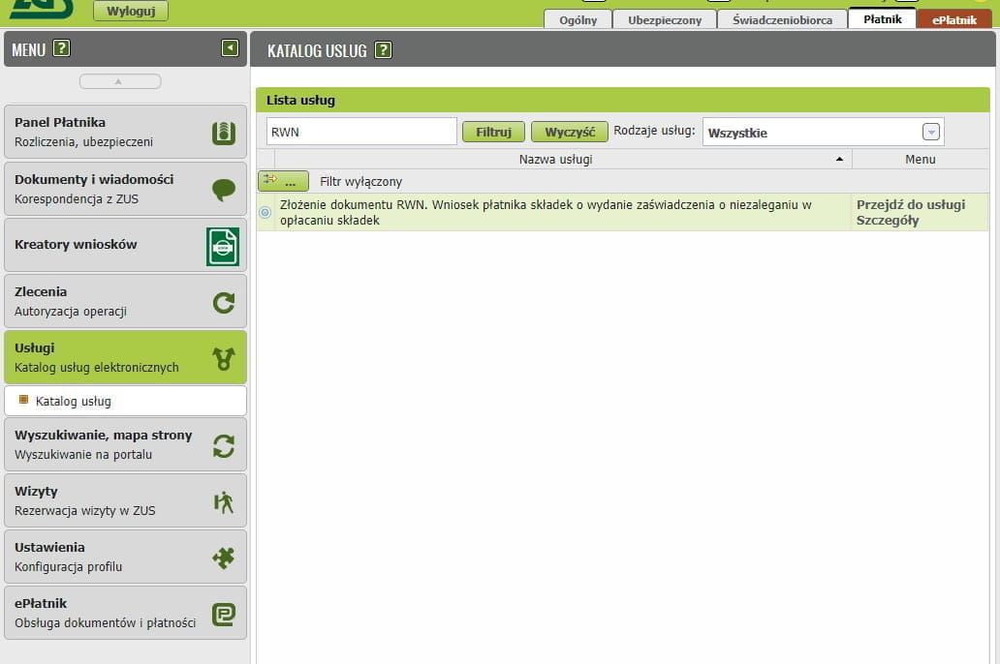

# Zakład Ubezpieczeń Społecznych

All entrepreneurs running a JDG in Poland are required to register with the national
[social insurance institution][1] and pay insurance contributions.

## Video

[:youtube: Almost everything you wanted to know about ZUS and weren't afraid to ask][100]

**Author:** [:telegram: Andrei][101]

Video contents:

- Types of ZUS contributions
- Differences between składka zdrowotna and other contributions
- Step-by-step walkthrough with a specific example
- Switching from Ulga na Start to składki preferencyjne
- Paying off last year's debt
- Choosing the składka zdrowotna level at the beginning of the year
- Nuances of suspending business activity

## Contribution amounts

ZUS consists of 2 main parts:

1. Health insurance (Składka zdrowotna)
2. Social insurance, which includes
    1. Pension insurance (Ubezpieczenie emerytalne)
    2. Disability insurance (Ubezpieczenie rentowe)
    3. Accident insurance (Ubezpieczenie wypadkowe)
    4. Labour Fund and Solidarity Fund (Fundusz pracy i Fundusz Solidarnościowy)
    5. Sickness insurance (Ubezpieczenie chorobowe)

The monthly health insurance contribution is calculated using the formula `base rate * 9%`.
The base rate depends on income:

1. Income up to 60,000 PLN: The base rate is 60% of the average salary
2. Income from 60,000 PLN to 300,000 PLN: The base rate is 100% of the average salary
3. Income above 300,000 PLN: The base rate is 180% of the average salary

In actual numbers **for 2024**, this is:

1. Income up to 60,000 PLN: 4,660.71 zł
2. Income from 60,000 PLN to 300,000 PLN: 7,767.85 zł
3. Income above 300,000 PLN: 13,982.13 zł

Plugging these numbers into the formula, we get the health insurance contributions:

1. 4,660.71  * 9% = 419.46 zł
2. 7,767.85 * 9% = 699.11 zł
3. 13,982.13 * 9% = 1,258.39 zł

It is important to note that when a threshold is exceeded, recalculation applies retroactively to previous months.

**Example:**

Maksym is taxed under Ryczałt on registered income.
In March 2024, Maksym's income exceeded 60,000 PLN, and in October it exceeded 300,000 PLN.
What would the annual health insurance contribution calculation look like?

Over the course of the year, Maksym would pay health insurance contributions as follows:

- January — 419.46 zł,
- February — 419.46 zł,
- March — 699.11 zł (exceeded the 60,000 zł threshold),
- April — 699.11 zł,
- May — 699.11 zł,
- June — 699.11 zł,
- July — 699.11 zł,
- August — 699.11 zł,
- September — 699.11 zł,
- October — 1,258.39 zł (exceeded the 300,000 zł threshold),
- November — 1,258.39 zł,
- December — 1,258.39 zł

Over the year, Maksym paid health insurance contributions totalling 9,507.86 PLN: `419.46 * 2 + 699.11 * 7 + 1258.39 * 3`.

Since Maksym exceeded the 300,000 PLN threshold for the calendar year, his monthly health insurance contribution should have been 1,258.39 PLN all along. Therefore, the annual contribution is: `1258.39 * 12 = 15,100.68`, but the total amount Maksym actually paid from the example above was only 9,507.86 PLN. This means that after the annual reconciliation, Maksym has an outstanding balance on his health insurance. He must pay an additional 5,592.82 PLN: `15,100.68 - 9,507.86`.

## ZUS contributions infographic

Visit the website [Składki ZUS (ryczałt)][102] (2026).

## ZUS contribution calculation table

<table>
    <thead>
        <tr>
            <th class="border-r text-center">
                Składki ZUS 2025 
                Ryczałt 
                A +
                B +
                C +
                D
            </th>
            <th class="border-r">Annual income</th>
            <th class="border-r ulga">Ulga na start</th>
            <th class="border-r preferencyjne-01-06">Składki preferencyjne (from 01.01 to 31.06)</th>
            <th class="border-r preferencyjne-07-12">Składki preferencyjne (from 01.07 to 31.12)</th>
            <th class="duzy">Duży zus</th>
        </tr>
    </thead>
    <tbody>
        <tr class="ulga-bg">
            <th rowspan="3" class="border-r border-t text-bl text-bold valign-center">
                A: Składka zdrowotna
            </th>
            <td class="border-r">0 - 60 000</td>
            <td colspan="4" class="text-bl text-center text-bold">461,66</td>
        </tr>
        <tr class="ulga-bg">
            <td class="border-r">60 000.01 - 300 000</td>
            <td colspan="4" class="text-bl text-center text-bold">769,43</td>
        </tr>
        <tr class="ulga-bg">
            <td class="border-r">&gt; 300 000</td>
            <td colspan="4" class="text-bl text-center text-bold">1384,97</td>
        </tr>
        <tr>
            <th rowspan="4" class="border-r border-t text-rd text-bold valign-center">
                B: ubezpieczenie społeczne
            </th>
            <td class="border-r">Emerytalna</td>
            <td class="border-r ulga text-center">0</td>
            <td class="border-r preferencyjne-01-06 text-center">273,24</td>
            <td class="border-r preferencyjne-07-12 text-center">273,24</td>
            <td class="duzy text-center">1015,78</td>
        </tr>
        <tr>
            <td class="border-r">Rentowa</td>
            <td class="border-r ulga text-center">0</td>
            <td class="border-r preferencyjne-01-06 text-center">111,98</td>
            <td class="border-r preferencyjne-07-12 text-center">111,98</td>
            <td class="duzy text-center">416,30</td>
        </tr>
        <tr>
            <td class="border-r">Wypadkowa</td>
            <td class="border-r ulga text-center">0</td>
            <td class="border-r preferencyjne-01-06 text-center">23,28</td>
            <td class="border-r preferencyjne-07-12 text-center">23,28</td>
            <td class="duzy text-center">86,90</td>
        </tr>
        <tr class="text-rd">
            <td class="border-r text-bold">
                <b>Total</b>
            </td>
            <td class="border-r ulga text-bold text-center"><b>0</b></td>
            <td class="border-r preferencyjne-01-06 text-bold text-center"><b>408,5</b></td>
            <td class="border-r preferencyjne-07-12 text-bold text-center"><b>408,5</b></td>
            <td class="duzy text-bold text-center"><b>1518,98</b></td>
        </tr>
        <tr class="text-green">
            <td colspan="2" class="border-r border-t text-green text-bold valign-center">
                <b>C: Fundusz Pracy</b>
            </td>
            <td class="border-r ulga text-center">0</td>
            <td class="border-r preferencyjne-01-06 text-center">0</td>
            <td class="border-r preferencyjne-07-12 text-center">0</td>
            <td class="duzy text-bold text-center">127,49</td>
        </tr>
        <tr class="text-bold">
            <th rowspan="3" class="border-r text-bold">
                <b>Total (A +
                B +
                C):</b>
                <td class="border-r">0 - 60 000</td>
                <td class="border-r ulga text-center text-bold">461,66</td>
                <td class="border-r preferencyjne-01-06 text-center text-bold">870,16</td>
                <td class="border-r preferencyjne-07-12 text-center text-bold">870,16</td>
                <td class="duzy text-bold text-center text-bold">2108,13</td>
            </th>
        </tr>
        <tr class="text-bold">
            <td class="border-r">60 000.01 - 300 000</td>
            <td class="border-r ulga text-center text-bold">769,43</td>
            <td class="border-r preferencyjne-01-06 text-center text-bold">1177,93</td>
            <td class="border-r preferencyjne-07-12 text-center text-bold">1177,93</td>
            <td class="duzy text-bold text-center text-bold">2415,90</td>
        </tr>
        <tr class="text-bold">
            <td class="border-r">&gt; 300 000</td>
            <td class="border-r ulga text-center text-bold">1384,97</td>
            <td class="border-r preferencyjne-01-06 text-center text-bold">1793,47</td>
            <td class="border-r preferencyjne-07-12 text-center text-bold">1793,47</td>
            <td class="duzy text-bold text-center">3031,44</td>
        </tr>
        <tr class="text-gr">
            <td colspan="2" class="border-r border-t text-gr text-bold valign-center">
                <b>D: Chorobowa</b> 
                (optional)
            </td>
            <td class="border-r ulga text-bold text-center">0</td>
            <td class="border-r preferencyjne-01-06 text-bold text-center">34,30</td>
            <td class="border-r preferencyjne-07-12 text-bold text-center">34,30</td>
            <td class="duzy text-bold text-center">127,49</td>
        </tr>
    </tbody>
</table>

The health component (zdrowotna) must always be paid, even if you also have insurance through an employment contract. The health contribution provides access to medical services for the entrepreneur and their family members.

Social benefit entitlements depend on paying the social contributions. These include maternity leave, sick leave, and future pension payments, but these benefits are proportional to the amount on which you pay contributions.

For the first 6 months you can take advantage of the "[Ulga na start][2]" relief and not pay social contributions. Accordingly, you will not be able to use social benefits either. After the startup relief expires, you can [switch][23] to the next relief — **Składki preferencyjne** — and use it for 24 months. After 30 months of activity you must [switch][26] to paying full ZUS (**duży ZUS**) — a minimum of 60% of the average salary.

More details at [biznes.gov.pl][25] and [e-pity][24]

## Registration

An entrepreneur is required to register with ZUS within 7 days of registering a JDG. This can be done either during the business registration process or afterwards.

## How to find your ZUS payment account

After registering the sole proprietorship, within approximately 2 weeks you should receive a letter (a physical envelope) from ZUS with all account details, etc., and the functionality will appear in your online account at [eskladka.pl][3].

You can also check accounts on the aforementioned website by entering two identifiers: NIP and REGON (or NIP and PESEL).

## How to pay ZUS

ZUS must be paid by the 20th of the month following the reporting month. For example, ZUS for July is due by August 20th.

Payment should be made via a standard bank transfer to your individual ZUS account. You can write anything in the payment description — it does not affect anything.

## Certificate of no outstanding ZUS debt

- You can physically go to any ZUS branch (any branch, not necessarily your district's) and obtain all certificates with wet stamps
- You can do it on the [ZUS portal](https://www.zus.pl/portal/)

### Select the RWN application

Go to the [Katalog usług elektronicznych](https://www.zus.pl/portal/obszar-platnika.npi#KUS0001) website and type `RWN` into the filter field.

### Verify the form data

You will be redirected to the **ZUS** `wniosek RWN` form. Verify the data in the form.

![zus_zaswiadczenie_2.png][7]

### Number of certificate copies

Select the number of certificate copies and click **Zapisz**.

![zus_zaswiadczenie_2.1.png][8]

### Close the document and confirm

![zus_zaswiadczenie_2.2.png][9]

![zus_zaswiadczenie_2.3.png][10]

### Review the document and click **Wyślij**

![zus_zaswiadczenie_2.4.png][11]

### Sign via Profil Zaufany

![zus_zaswiadczenie_2.5.png][12]

Click **Ok**

![zus_zaswiadczenie_2.6.png][13]

### Documents sent — wait for confirmation

![zus_zaswiadczenie_2.7.png][14]

### Retrieve the certificate

Once the letter arrives (1–7 days), log into [ZUS][1].
In the menu, select `Płatnik` (sometimes it arrives in the `Ogólny` tab).
On the left, go to **Dokumenty i wiadomości** then **Korespondencja z ZUS**.
Select the document and confirm receipt via Profil Zaufany.

![zus_zaswiadczenie_4.png][15]

### Download the certificate

After confirmation, the **Szczegóły** option will appear.

![zus_zaswiadczenie_4.1.png][16]

Open the document via **Przeglądaj dokument**.

![zus_zaswiadczenie_4.2.png][17]

Print via **Drukuj**.

![zus_zaswiadczenie_4.3.png][18]

## Linking ePUAP to your ZUS profile

1. If you have a profil zaufany, go to Panel ogólny -> Ustawienia -> Dane profilu and click Dodaj powiązanie z ePUAP.
    ![zus_epuap_1.png][19]
2. You will be redirected to the trusted profile login page — log in and sign with profilem zaufany.
    ![zus_epuap_2.png][20]
    ![zus_epuap_3.png][21]
3. As a result, your ZUS profile will be linked with profilem zaufanym.
    ![zus_epuap_4.png][22]

[1]: https://www.zus.pl
[2]: zus_ulga_na_start.md
[3]: https://eskladka.pl/Home
[4]: https://www.biznes.gov.pl/pl/firma/zus/chce-rozliczac-zus/proc_750-zaswiadczenie-o-niezaleganiu-zus
[5]: images/zus_zaswiadczenie/zus_zaswiadczenie_1.png
[6]: images/zus_zaswiadczenie/zus_zaswiadczenie_1.1.png
[7]: images/zus_zaswiadczenie/zus_zaswiadczenie_2.png
[8]: images/zus_zaswiadczenie/zus_zaswiadczenie_2.1.png
[9]: images/zus_zaswiadczenie/zus_zaswiadczenie_2.2.png
[10]: images/zus_zaswiadczenie/zus_zaswiadczenie_2.3.png
[11]: images/zus_zaswiadczenie/zus_zaswiadczenie_2.4.png
[12]: images/zus_zaswiadczenie/zus_zaswiadczenie_2.5.png
[13]: images/zus_zaswiadczenie/zus_zaswiadczenie_2.6.png
[14]: images/zus_zaswiadczenie/zus_zaswiadczenie_2.7.png
[15]: images/zus_zaswiadczenie/zus_zaswiadczenie_4.png
[16]: images/zus_zaswiadczenie/zus_zaswiadczenie_4.1.png
[17]: images/zus_zaswiadczenie/zus_zaswiadczenie_4.2.png
[18]: images/zus_zaswiadczenie/zus_zaswiadczenie_4.3.png
[19]: images/zus_epuap/zus_epuap_1.png
[20]: images/zus_epuap/zus_epuap_2.png
[21]: images/zus_epuap/zus_epuap_3.png
[22]: images/zus_epuap/zus_epuap_4.png
[23]: zus_obnizone_skladki.md
[24]: https://www.e-pity.pl/kalkulatory-podatkowe/skladki-zus-przedsiebiorcy/
[25]: https://www.biznes.gov.pl/pl/portal/00286#2
[26]: zus_duzy.md
[100]: https://youtu.be/FJVhBu-_nyA
[101]: https://t.me/justandrei79
[102]: https://justandrei.github.io/jdg-tools/zus/
