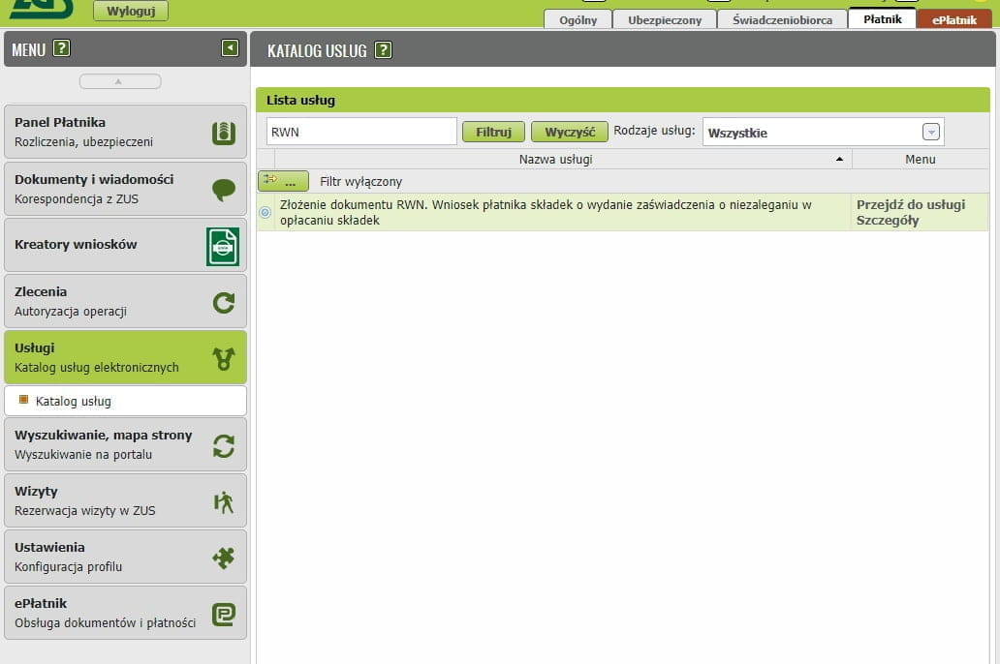

# Zakład Ubezpieczeń Społecznych

Все предприниматели, ведущие JDG в Польше обязаны застраховаться в государственной
[службе социального страхования][1] и оплачивать страховые взносы.

## Размер взносов

ZUS состоит из 2 основных частей:

1. Медицинское страхование (Składka zdrowotna)
2. Социальное страхование, включает в себя
    1. Пенсионное страхование (Ubezpieczenie emerytalne)
    2. Страхование от потери трудоспособности (Ubezpieczenie rentowe)
    3. Страхование от несчастных случаев (Ubezpieczenie wypadkowe)
    4. Фонд труда и Фонд солидарности (Fundusz pracy i Fundusz Solidarnościowy)
    5. Страхование на случай болезни (Ubezpieczenie chorobowe)

Размер взносов по медицинскому страхованию в месяц рассчитывается по формуле `базовая ставка * 9%`.
Размер базовой ставки рассчитывается от дохода:

1. Доход до 60 000 злотых: Базовая ставка вычисляется как 60% от средней заработной платы
2. Доход от 60 000 злотых до 300 000 злотых: Базовая ставка вычисляется как 100% от средней заработной платы
3. Доходы выше 300 000 злотых: Базовая ставка вычисляется как 180% процентов от средней зарплаты

В буквальных цифрах **на 2023 год** это:

1. Доход до 60 000 злотых: 4179.56 zł
2. Доход от 60 000 злотых до 300 000 злотых: 6965.94 zł
3. Доходы выше 300 000 злотых: 12538.69 zł

Далее, подставим в формулу числа и получим размеры взносов по медицинскому страхованию:

1. 4179.56 * 9% = 376.16 zł
2. 6965.94 * 9% = 626.93 zł
3. 12538.69 * 9% = 1128.48 zł

Важно отметить, что при превышении порога, пересчет идет и за прошлые месяцы.

**Пример:**

Максим облагается Ryczałt-налогом на зарегистрированный доход.
В марте 2022 года доход Макса превысил 60 000 злотых, а в октябре - более 300 000 злотых.
Как будет выглядеть ежегодный расчет взноса на здравоохранение?

В течение года Максим должен выплачивать взносы на медицинское обслуживание по следующей схеме:

- Январь - 376.16 zł,
- Февраль  - 376.16 zł,
- Март - 626.93 zł (превышение порога в 60 000 zł),
- Апрель - 626.93 zł,
- Май - 626.93 zł,
- Июнь - 626.93 zł,
- Июль - 626.93 zł,
- Август- 626.93 zł,
- Сентябрь - 626.93 zł,
- Октябрь  - 1128.48 zł (превышение порога в 300 000 zł),
- Ноябрь - 1128.48 zł,
- Декабрь - 1128.48 zł

В течение года Макс выплатил взносы на здравоохранение на общую сумму 8526.27 злотых: `376.16 * 2 + 626.93 * 7 + 1128.48 * 3`.

Поскольку за календарный год Макс превысил порог в 300 000 злотых, он должен ежемесячно делать взносы за медицинское страхование
в размере 1128.48 злотых. Таким образом, годовой взнос составляет 1128.48 злотых * 12 месяцев = 13 541.76 злотых, но сумма
взносов Максима из примера выше составила всего 8526.27 злотых. Это означает, что после завершения годового расчета у Максима
осталась недоплата взноса на медицинское обслуживание. Он обязан выплатить еще 5 015,49 злотых (13 541.76 злотых - 8 526.27 злотых).

Таблица расчета взносов социального и медицинского страхования на системе налогообложения Ryczałt в 2022 году:

<table>
    <thead>
        <tr>
            <th class="border-r text-center">
                Składki ZUS 2022 
                Ryczałt 
                A +
                B +
                C
            </th>
            <th class="border-r">Годовой доход</th>
            <th class="border-r ulga">Ulga na start</th>
            <th class="border-r preferencyjne">Składki preferencyjne</th>
            <th class="duzy">Duży zus</th>
        </tr>
    </thead>
    <tbody>
        <tr class="ulga-bg">
            <th rowspan="3" class="border-r border-t text-bl text-bold valign-center">
                A: Składka zdrowotna
            </th>
            <td class="border-r">0 - 60 000</td>
            <td colspan="3" class="text-bl text-center text-bold">376.16</td>
        </tr>
        <tr class="ulga-bg">
            <td class="border-r">60 000.01 - 300 000</td>
            <td colspan="3" class="text-bl text-center text-bold">626.93</td>
        </tr>
        <tr class="ulga-bg">
            <td class="border-r">&gt; 300 000</td>
            <td colspan="3" class="text-bl text-center text-bold">1128.48</td>
        </tr>
        <tr>
            <td colspan="2" class="border-r">Emerytalna</td>
            <td class="border-r ulga">0</td>
            <td class="border-r preferencyjne">204.37</td>
            <td class="duzy">812.23</td>
        </tr>
        <tr>
            <td colspan="2" class="border-r">Rentowa</td>
            <td class="border-r ulga">0</td>
            <td class="border-r preferencyjne">83.76</td>
            <td class="duzy">332.88</td>
        </tr>
        <tr>
            <td colspan="2" class="border-r">Wypadkowa</td>
            <td class="border-r ulga">0</td>
            <td class="border-r preferencyjne">17.48</td>
            <td class="duzy">69.49</td>
        </tr>
        <tr>
            <td colspan="2" class="border-r">Na Fundusz Pracy</td>
            <td class="border-r ulga">0</td>
            <td class="border-r preferencyjne">0</td>
            <td class="duzy">101.97</td>
        </tr>
        <tr class="text-rd">
            <td colspan="2" class="border-r text-bold">
                B: вместе
            </td>
            <td class="border-r ulga text-bold">0</td>
            <td class="border-r preferencyjne text-bold">305.61</td>
            <td class="duzy text-bold">1316.54</td>
        </tr>
        <tr class="text-gr">
            <td colspan="2" class="border-r text-bold">
                C: Chorobowa 
                (не обязательная, для гос. больничных)
            </td>
            <td class="border-r ulga text-bold">0</td>
            <td class="border-r preferencyjne text-bold">25.65</td>
            <td class="duzy text-bold">101.94</td>
        </tr>
    </tbody>
</table>

Медицинскую часть (zdrowotna) нужно платить всегда, даже если параллельно есть
еще страховка по трудовому договору. Медицинская складка даёт доступ
к медицинскому обслуживанию для предпринимателя и членов его семьи.

От уплат социальной складки зависят социальные выплаты. В том числе —
декретные, больничные, будущая пенсия, но эти выплаты пропорциональны сумме с которой вы оплачиваете взносы.

Первые 6 месяцев можно пользоваться льготой "Ulga na start" и не платить
социальные складки. Соответственно, социальными выплатами тоже воспользоваться не получится. После истечения льготы на старт, можно
[перейти][27] на следующую льготу — **ZUS preferencyjne** и пользоваться ею в
течение 24 месяцев. После 30 месяцев деятельности начинается оплата полного ZUS (duży zus) — минимум 60% от средней заплаты.

Больше деталей на [e-pity][28]

## Ulga na start

Для новых предпринимателей есть возможность получить льготу
для оплаты ZUS на первые полгода и уменьшенный ZUS на следующие два года.

Для получения льготы нужно во время регистрации в ZUS указать в декларации ZUS ZZA код **05 40**.

[Официальный сайт][2]

## Регистрация

Предприниматель обязан в течение 7 дней после регистрации JDG зарегистрироваться
в ZUS. Сделать это можно как во время регистрации деятельности, так и позже.

## Как узнать свой счет для оплаты ZUS

После регистрации ИП через +-2 недели должно прийти письмо (физическое, конверт) из ZUS со всеми счетами и т.д. и функционал появится в кабинете, на сайте [eskladka.pl][3].

А так же можно проверить счета на вышеупомянутом сайте, для этого необходимо ввести два идентификатора NIP и REGON (или NIP и PESEL).

## Как платить ZUS

Оплачивать ZUS нужно до 20 числа следующего месяца за отчетным.
Например, за июль зус оплачивается до 20 августа.

Оплату следует производить обычным переводом на индивидуальный счет ZUS.
В назначении платежа можно писать что угодно, это ни на что не влияет.

## Справка о незадолженности в ZUS

- Можно пойти физически в отделение ZUS (любое, не обязательно вашего района) и получить все справки с мокрыми печатями
- Можно на [портале ZUS](https://www.zus.pl/portal/)

1. Переходим на сайт [Katalog usług elektronicznych](https://www.zus.pl/portal/obszar-platnika.npi#KUS0001), в окно фильтра вписываем `RWN`.

    

2. Нас перекидывает в **ZUS** на форму заполнения `wniosek RWN`. Проверяем данные в форме.

   ![zus_zaswiadczenie_2.png][7]

3. Выбираем кол-во экземпляров справки и нажимаем **Zapisz**.

   ![zus_zaswiadczenie_2.1.png][8]

4. Закрываем документ.

   ![zus_zaswiadczenie_2.2.png][9]

5. Соглашаемся.

    ![zus_zaswiadczenie_2.3.png][10]

6. Проверяем документ и нажимаем **Wyślij**.

   ![zus_zaswiadczenie_2.4.png][11]

7. Подписываем через Profil Zaufany

   ![zus_zaswiadczenie_2.5.png][12]

8. Нажимаем **Ok**

   ![zus_zaswiadczenie_2.6.png][13]

9. Нажимаем **Ok**

   ![zus_zaswiadczenie_2.7.png][14]

10. На почту придет (если на www.biznes.gov.pl настроена почта) сообщение, что заявление принято.

    ![zus_zaswiadczenie_3.png][15]

11. В разделе **Konto Przedsiębiorcy**. В пункте **Moje sprawy** появится запись.

    ![zus_zaswiadczenie_3.1.png][16]

12. Если кликнуть на **Zaświadczenie o niezaleganiu w opłacaniu składek ZUS** увидим статус заявки.

    ![zus_zaswiadczenie_3.2.png][17]

13. Позднее придет сообщение на почту о получении нового документа в ZUS (Serwis Biznes.gov.pl - Nowy dokument z ZUS)

    ![zus_zaswiadczenie_3.3.png][18]

14. Далее заходим в [ZUS][1]. В меню выбираем Płatnik. Слева в меню **Dokumenty i wiadomości** **Korespondencja z ZUS**. Выбираем документ и подтверждаем получение через Profil Zaufany.

    ![zus_zaswiadczenie_4.png][19]

15. После подтверждения появится пункт **Szczegóły**

    ![zus_zaswiadczenie_4.1.png][20]

16. Открываем документ **Przeglądaj dokument**.

    ![zus_zaswiadczenie_4.2.png][21]

17. Печатаем **Drukuj**.

    ![zus_zaswiadczenie_4.3.png][22]

## Добавление ePUAP к профилю ZUS

1. Если у вас есть profil zaufany, перейдите к Panel ogólny -> Ustawienia -> Dane profilu и нажмите Dodaj powiązanie z ePUAP.

    ![zus_epuap_1.png][23]

2. Вы будете перенаправлены на страницу входа в доверенный профиль, залогиньтесь и подпишите profilem zaufany.

    ![zus_epuap_2.png][24]
    ![zus_epuap_3.png][25]

3. в итоге профиль ZUS будет связан с profilem zaufanym.

    ![zus_epuap_4.png][26]

[1]: https://www.zus.pl
[2]: https://www.biznes.gov.pl/pl/firma/zus/chce-rozliczac-zus/ulga-na-start-6-miesiecy-bez-skladek-na-ubezpieczenie-spoleczne
[3]: https://eskladka.pl/Home
[4]: https://www.biznes.gov.pl/pl/firma/zus/chce-rozliczac-zus/proc_750-zaswiadczenie-o-niezaleganiu-zus
[5]: images/zus_zaswiadczenie/zus_zaswiadczenie_1.png
[6]: images/zus_zaswiadczenie/zus_zaswiadczenie_1.1.png
[7]: images/zus_zaswiadczenie/zus_zaswiadczenie_2.png
[8]: images/zus_zaswiadczenie/zus_zaswiadczenie_2.1.png
[9]: images/zus_zaswiadczenie/zus_zaswiadczenie_2.2.png
[10]: images/zus_zaswiadczenie/zus_zaswiadczenie_2.3.png
[11]: images/zus_zaswiadczenie/zus_zaswiadczenie_2.4.png
[12]: images/zus_zaswiadczenie/zus_zaswiadczenie_2.5.png
[13]: images/zus_zaswiadczenie/zus_zaswiadczenie_2.6.png
[14]: images/zus_zaswiadczenie/zus_zaswiadczenie_2.7.png
[15]: images/zus_zaswiadczenie/zus_zaswiadczenie_3.png
[16]: images/zus_zaswiadczenie/zus_zaswiadczenie_3.1.png
[17]: images/zus_zaswiadczenie/zus_zaswiadczenie_3.2.png
[18]: images/zus_zaswiadczenie/zus_zaswiadczenie_3.3.png
[19]: images/zus_zaswiadczenie/zus_zaswiadczenie_4.png
[20]: images/zus_zaswiadczenie/zus_zaswiadczenie_4.1.png
[21]: images/zus_zaswiadczenie/zus_zaswiadczenie_4.2.png
[22]: images/zus_zaswiadczenie/zus_zaswiadczenie_4.3.png
[23]: images/zus_epuap/zus_epuap_1.png
[24]: images/zus_epuap/zus_epuap_2.png
[25]: images/zus_epuap/zus_epuap_3.png
[26]: images/zus_epuap/zus_epuap_4.png
[27]: zus_obnizone_skladki.md
[28]: https://www.e-pity.pl/kalkulatory-podatkowe/skladki-zus-przedsiebiorcy/
